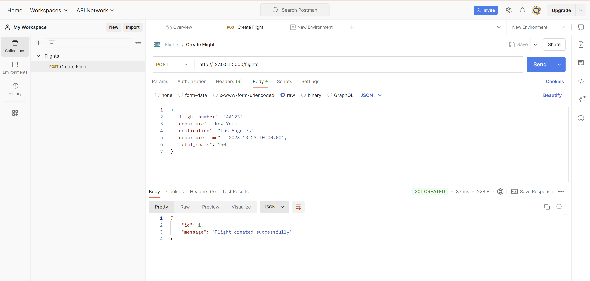

# flight-reservation

To interact with the app, download and setup Postman Desktop Agent via https://www.postman.com/downloads/postman-agent/

Run the app:
    
    - make sure you're in the root of the repository (`flight-reservation`)
    
    - run `python app.py` in the terminal
    
    - it should output a link to go to like "Running on http://127.0.0.1:5000"
    
    - go to the postman API website (https://www.postman.com/), you'll prob have to make an account
    
    - Click "New Request" 
        This will be how we interact with the database
    
For example, creating a Flight:
    
    - make sure the Desktop Agent is running (otherwise we can't interact w local urls)
    
    - create a POST request, with the link pointed to <<the app's local url>>/flights,
    
    - put a JSON body of data for the Flight parameters in the `Body` (raw, JSON format),
    
    - hit SEND & you should get a return message:

    
